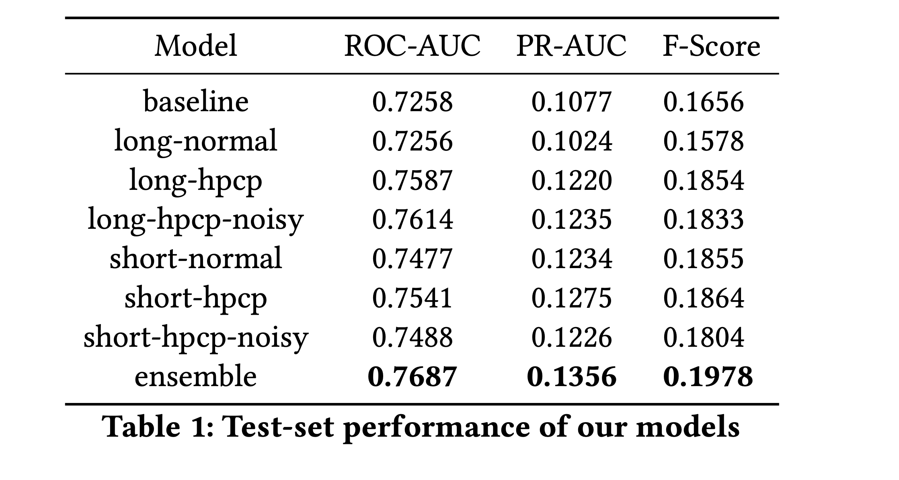

## Noisy-student training for music emotion recognition

Work paper: https://arxiv.org/pdf/2112.00702.pdf

Codebase of Mirable's submission for MediaEval 2021 Emotions and Themes in Music challenge. This attempt mainly focuses on using noisy student training for music emotion tagging.

TLDR:
- To first achieve a stronger teacher model, we inspect the factors of:
    - long / short training input audio length
    - using HPCP
- We first pre-train a good enough teacher model on labelled MTG-Jamendo 
- Then we use the full MTG-Jamendo with predicted labels by teacher model to train a noisy student model, hoping that it learns better

### Results



Findings:
- HPCP consistently improves results
- Short models have better PR-AUC, long models have better ROC-AUC
- Ensembling long & short models can improve performance significantly
- (Sadly) results for noisy student training are inconclusive - we find improvements in long model, but not in short model

### How to use this code

Model weights are open-sourced in the `models/` folder.

First clone `mtg-jamendo-dataset` repo, and place this directory under `scripts/`

#### Training

1. Extract mel-spectrograms `preprocess/extract_melspec.py` (with `nnAudio`)

2. Extract HPCPs `preprocess/extract_hpcp.py` (with `essentia`)

3. We provide training scripts for `normal`, `hpcp` and `noisy`. Remember to specify input length mode `long || short`, for example:

```
python train_hpcp.py --input_length long
```

#### Evaluation

Model choice can be `normal`, `hpcp`, `hpcp-noisy`

```
python tester_short_chunk.py --model hpcp
```

